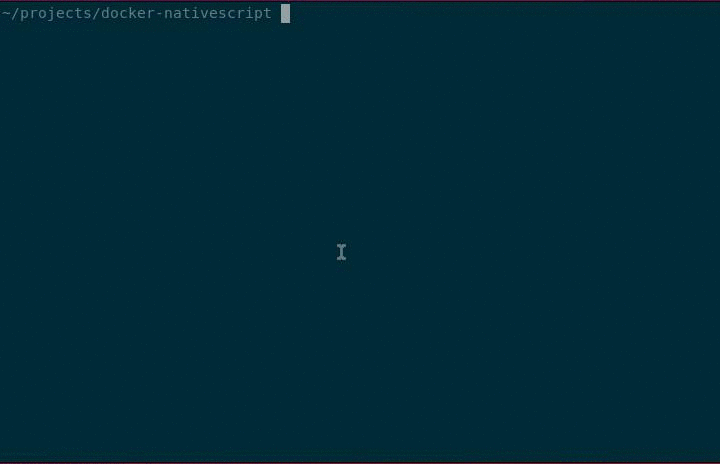

# Docker container for NativeScript development

## Content

* [why](#why)
* [Setup](#setup)
* [New Project](#new-project)
* [Useful commands](#useful-commands)
* [References](#references)

## Why?
I wanted to explore [NativeScript](https://www.nativescript.org) but didn't want to install and configure Java, Android SDK, Ant, etc. Life is too short so I created a Docker container with everything needed to run it.  
Here is the relevant blog post: http://oren.github.io/blog/nativescript.html

## Setup

    git clone git@github.com:oren/docker-nativescript.git
    cd docker-nativescript
    docker build -t nativescript .
    alias tns='docker run -it --rm --privileged -v /dev/bus/usb:/dev/bus/usb -v $PWD:/src nativescript tns'

The alias command lets you use `tns` for running any command inside the nativescript container.

## New Project

    tns create hello
    cd hello
    tns platform add android
    tns run android

That's it, your app should be on your phone!

## References

The image is a modification of https://github.com/Kallikrein/dockerfiles/tree/master/android-cordova
